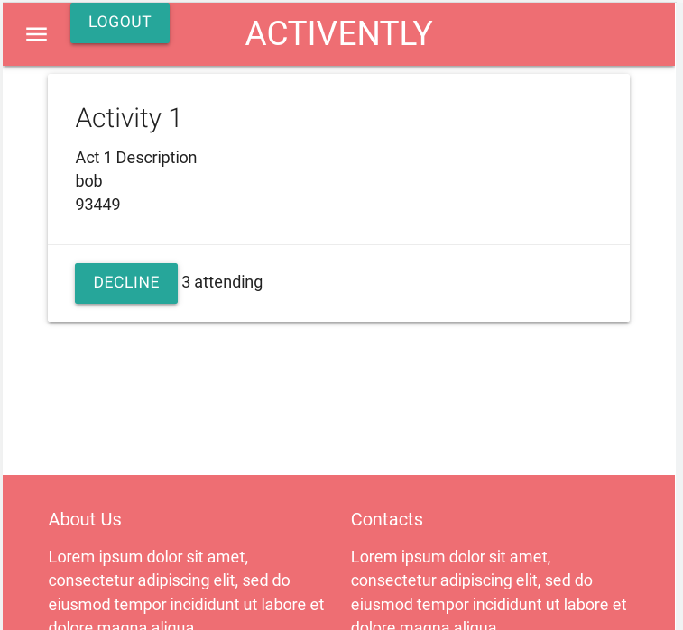

# Activently

## Table of Contents

- [Description](#description)
- [Requirements](requirements)
- [Installation](#installation)
- [Screenshot](#screenshot)
- [Video](#video)
- [Questions](#questions)

## Description

Activently is an app that allows users to create activities that other people in the community can then join. As of this moment, users can see events happening, create events, delete event (if they are the creator), and even update events. They can also update their user profile. Yes, it seems a bit like myspace.

## Requirements

- Use Node.js and Express.js to create RESTful APIs (GET and POST routes, API keys)
- Templating Engine: Handlebars.js
- Database: MySQL
- ORM: Sequelize
- Hosting Provider: Heroku
- Authentication/Session Management: express-session and cookies
- One additional library not discussed in class
- Polished, responsive, interactive UI
- Folder structure meets MVC paradigm (`models`, `views`, `controllers`)
- Use environment variables to protect sensitive information
- Clean repository
- Quality README

## Installation

To install run npm i. To start run "npm run start" in the command line.

## Screenshot

Here is a screenshot of it working.

## Video

[Here is the video](./public/images/activently.webm)

## Questions

If you have any questions please check out [my github](https://github.com/Naomilounsbury/activently)
